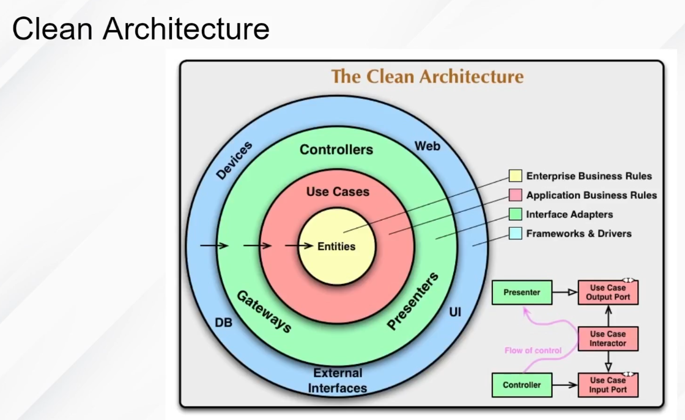

# Clean Architecture




# 🧱 Estrutura de Pastas — Clean Architecture

```bash
src/
├── domain/                 # Regras de negócio (camada mais pura)
│   ├── entities/           # Entidades do domínio
│   ├── repositories/       # Interfaces dos repositórios
│   ├── services/           # Lógicas de negócio
│   └── use-cases/          # Casos de uso do sistema
│
├── application/            # Camada de aplicação
│   ├── dto/                # Data Transfer Objects
│   ├── interfaces/         # Interfaces dos adaptadores (gateways)
│   └── use-cases/          # Implementações dos casos de uso
│
├── infrastructure/         # Infraestrutura e detalhes técnicos
│   ├── database/           # Conexão e implementação de repositórios
│   │   ├── prisma/         # Ex: Prisma ORM
│   │   └── knex/           # Ou outro ORM
│   ├── external/           # Integrações externas (APIs, serviços)
│   └── logger/             # Log personalizado
│
├── interfaces/             # Interface do mundo externo (adapters)
│   ├── controllers/        # Controllers da API (ex: REST, GraphQL)
│   ├── routes/             # Rotas do sistema
│   └── middlewares/        # Middlewares (auth, validação, etc)
│
├── shared/                 # Código reutilizável (helpers, utils, etc)
│   ├── utils/
│   └── config/             # Configurações da aplicação
│
└── main.ts                 # Ponto de entrada da aplicação
